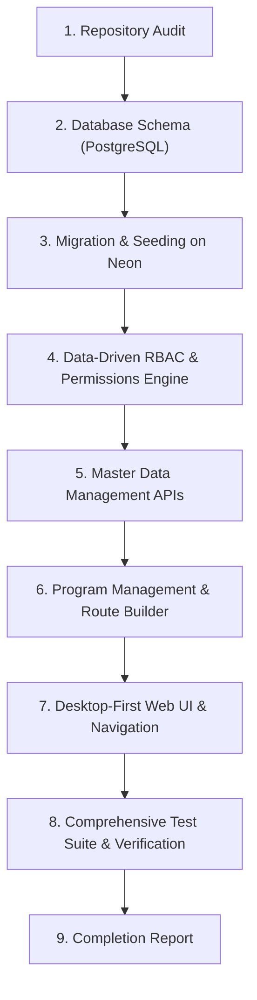

# Phase 1 Architectural Audit & Gap Analysis

**System**: Subham Fabrics Garment Manufacturing Execution System (MES)  
**Date**: September 29, 2026  
**Auditor**: Principal MES Architect & Senior Engineering Team  

---

## 1. Executive Summary
This audit inspects the repository foundation, architecture, database schemas, authentication, master data governance, and program management capabilities in accordance with the Phase 1 MES requirements. The objective is to stabilize the technical foundation, migrate to the target PostgreSQL database (Neon Serverless PostgreSQL), enforce granular data-driven RBAC, and deliver robust Master Data and Program Management capabilities.

---

## 2. Component-by-Component Analysis

### A. Database & Persistence Layer
- **Current State**: Prisma ORM schema previously defaulted to SQLite for local development (`mes.db`), with an auxiliary PostgreSQL schema file.
- **Identified Gap / Risk**: 
  - Phase 1 mandates real PostgreSQL with enterprise schemas: `users`, `roles`, `permissions`, `user_roles`, `departments`, `work_centers`, `machines`, `shifts`, `suppliers`, `customers`, `items`, `fabrics`, `trims`, `designs`, `colours`, `sizes`, `defect_codes`, `operations`, `programs`, `program_fabrics`, `program_colours`, `program_sizes`, `program_specifications`, `program_bom`, `program_routes`, `program_route_steps`, `audit_logs`, and `attachments`.
  - Missing fine-grained work centers, machine master registers, shift definitions, operation catalogs, customer/supplier masters, and defect taxonomy tables in active schema.
- **Action**: Unify `schema.prisma` with `provider = "postgresql"` targeting the Neon database (`neondb`). Implement all 24 required relational models with explicit foreign keys, indexes, check constraints, and timestamps.

### B. Authentication & Authorization (RBAC)
- **Current State**: Basic JWT authentication with role string check in `RolesGuard` and BCrypt hashing.
- **Identified Gap / Risk**: 
  - Roles were hard-coded as enum strings (`SUPER_ADMIN`, `PRODUCTION_MANAGER`, etc.) rather than a data-driven `Role` and `Permission` relationship (`module`, `resource`, `action`).
  - Missing permissions table linking actions (`CREATE`, `READ`, `UPDATE`, `APPROVE`, `ISSUE`, `RECEIVE`) across resources (`PROGRAM`, `CHALLAN`, `INVENTORY`, `MASTER_DATA`).
  - Missing user-role assignment table allowing dynamic multi-role assignment.
- **Action**: Implement data-driven RBAC schema (`User`, `Role`, `Permission`, `RolePermission`, `UserRole`) with a custom NestJS `PermissionsGuard` checking granular permission matrices.

### C. Master Data Management
- **Current State**: Departments seeded directly in seed script; basic read endpoint exists.
- **Identified Gap / Risk**: 
  - Missing standalone CRUD endpoints and UI interfaces for: Suppliers, Customers, Fabrics, Trims/Materials, Designs, Colours, Sizes, Departments, Work Centers, Machines, Shifts, Operations, Defect Codes.
  - Search, filter, pagination, active/inactive toggles, and uniqueness validation need dedicated service handlers.
- **Action**: Implement a dedicated `MastersModule` in NestJS with comprehensive CRUD, pagination, filtering, uniqueness guarantees, and audit logging. Build responsive desktop-first master data management screens in Next.js.

### D. Program Management & Production Routing
- **Current State**: Program file creation endpoint and basic view.
- **Identified Gap / Risk**: 
  - Program route builder lacked explicit configuration for operation types, expected cycle duration, input/output unit type, rework allowance, skip allowance, and optional/parallel indicators.
  - Missing customer master relation (previously simple string).
  - Missing attachment management metadata (tech packs, CAD drawings, measurement spec sheets).
- **Action**: Expand Program domain model to support granular sub-tables, dynamic route steps, formal state machine transitions (`DRAFT` ➔ `SUBMITTED` ➔ `APPROVED` ➔ `IN_PRODUCTION`), and an interactive multi-step Program Builder.

### E. Frontend Architecture & UI
- **Current State**: Next.js App Router with TailwindCSS.
- **Identified Gap / Risk**: 
  - Navigation menu needs expansion to reflect the exact operational standard:
    - **Overview**
    - **Production**: Programs, Planning, Floor Board, Active Production, Challans, WIP
    - **Store**: Stock, Receive, Issue, Trims, Issue Challan, Defected Shelf, Stock Ledger
    - **Quality**: QC Queue, Inspections, Defects, Rework, Rejections
    - **Insights**: Reports, Production Analytics, Quality Analytics, Inventory Analytics, Department Performance
    - **Administration**: Setup, Users, Roles, Permissions, Departments, Masters, Audit Log, Settings
  - Advanced pages for future phases must be clearly watermarked as "Phase 2 / Phase 3 functionality" without fake placeholder mock numbers.
- **Action**: Re-structure sidebar navigation according to the exact taxonomy and build dedicated master data views and program configuration panels.

### F. Security & Performance Risks
- **Identified Risks**:
  - Connection pooling: Neon PostgreSQL requires pooling (`sslmode=require&channel_binding=require`).
  - Plaintext password exposure: Must strictly enforce bcrypt hashing (minimum 10 salt rounds).
  - Rate limiting: API endpoints need rate-limiting guards against brute-force authentication attempts.
  - Audit logging: Must record actor IP, User-Agent, before-state, and after-state for every mutation.

---

## 3. Phase 1 Implementation Plan

---

## 4. Acceptance Criteria Checklist
- [x] Repository audit completed and documented.
- [ ] PostgreSQL schema with all required models migrated to Neon.
- [ ] Data-driven RBAC engine (`module`, `resource`, `action`) implemented.
- [ ] Complete Master Data CRUD (Suppliers, Customers, Fabrics, Trims, Designs, Colours, Sizes, Departments, Work Centers, Machines, Shifts, Operations, Defect Codes).
- [ ] Program File management (Fabric specs, Size/Colour breakdown, BOM, Configurable Route, Approval Workflow).
- [ ] Initial Overview Dashboard with real database aggregates (no hard-coded statistics).
- [ ] Audit trail logging every mutation with before/after state diffs.
- [ ] Automated test suite validating RBAC, Masters CRUD, Program validation, and unauthorized access.
