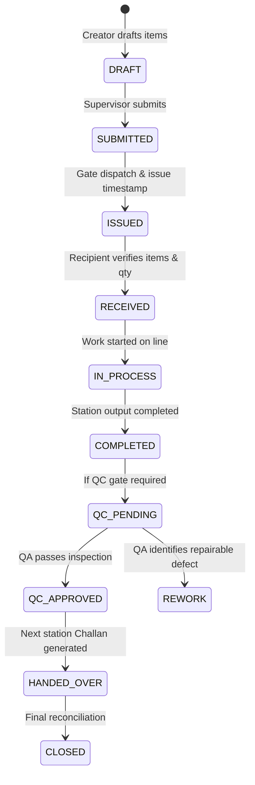

# Standard Operating Procedure (SOP-02)
## Inter-Departmental Challan Handoff & Genealogy Lifecycle

### 1. Purpose
To ensure zero unaccounted inventory between factory stations. Every physical movement of materials must be accompanied by an electronic Challan signed by both dispatching and receiving supervisors.

### 2. Challan Lifecycle States

### 3. Traceability Chain
Every Challan record stores:
- `programId`: The overarching manufacturing order.
- `parentChallanId`: Direct antecedent handoff document.
- `sourceLotId` / `sourceRollId` / `sourceBundleId`: Piece-level backward genealogy.
